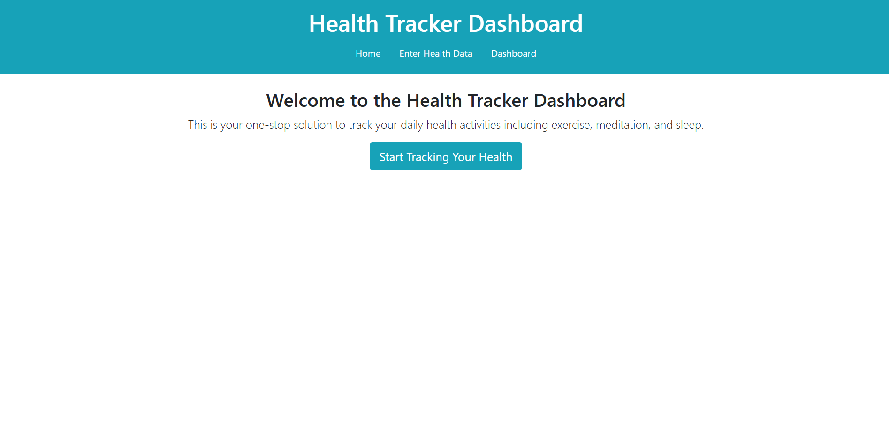
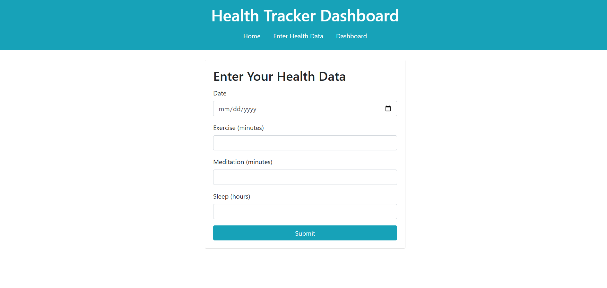
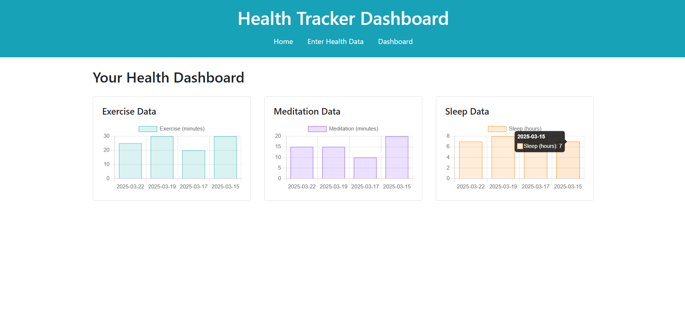

# Flask - Health Tracker Dashboard

A simple Flask-based web application that helps you track daily health metrics including exercise, meditation, and sleep. This dashboard allows users to enter their daily health data and visualize the data in bar charts.

## Features
**Home Page:** Introductory page with a call-to-action button to start tracking health.

**Data Entry:** A form to input date, exercise minutes, meditation minutes, and hours of sleep.

**Dashboard:** A visual representation of your data in bar charts for easy monitoring of progress.

## Home

## Data Input

## Health Tracker Dashboard

## Getting Started
These instructions will help you set up and run the project on your local machine.

### Prerequisites
- Python 3.x installed on your system

- Git (optional but recommended for cloning the repository)

- Basic knowledge of using a terminal/command prompt

### Installation
1. Clone this repository (or download the ZIP):

  git clone https://github.com/YourUsername/Flask-WebDevelopment.git

  cd Flask-WebDevelopment

2. Create a virtual environment

python -m venv venv

3. Activate the virtual environment:
   
venv\Scripts\activate

4. Install required packages:
   
pip install -r requirements.txt

### Running the Application
1. Make sure you’re in the project directory and your virtual environment is activated
2. Run the Flask app:
   
python app.py

3. The application will start, and you should see something like:
* Serving Flask app 'app'
* Running on http://127.0.0.1:5000/ (Press CTRL+C to quit)
  
4. Open your browser and go to http://127.0.0.1:5000/ (or the URL shown in your terminal). You should see the Home Page of the Health Tracker Dashboard.

## Usage
**Home Page:** Click “Start Tracking Your Health” to begin.

**Enter Health Data:**
- Select a date (mm/dd/yyyy format).
- Enter exercise minutes, meditation minutes, and sleep hours.
- Click Submit to store your data.
  
**View Dashboard:**
- Go to the Dashboard tab in the navigation bar.
- View your exercise, meditation, and sleep data in bar charts.

## Technologies Used

- Flask (Python micro web framework)
- SQLite (or any other DB you configured)
- HTML5, CSS3, Bootstrap for styling
- Chart.js (or similar library) for creating interactive charts

